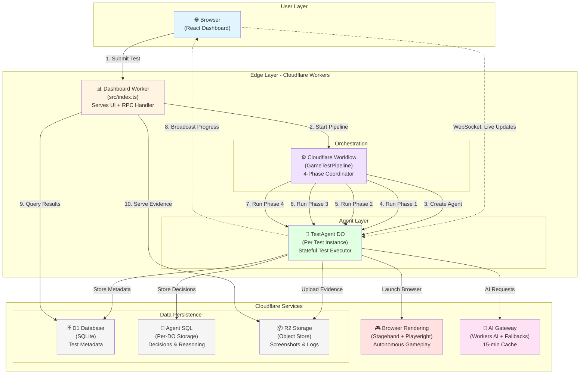
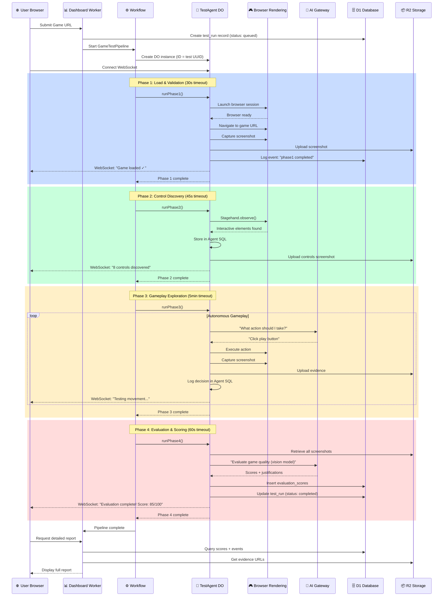
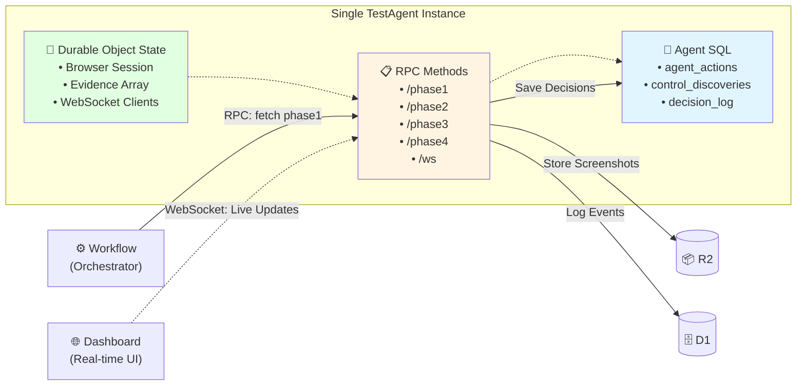
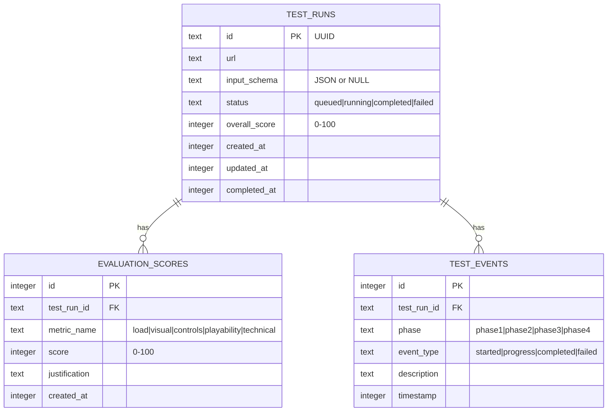
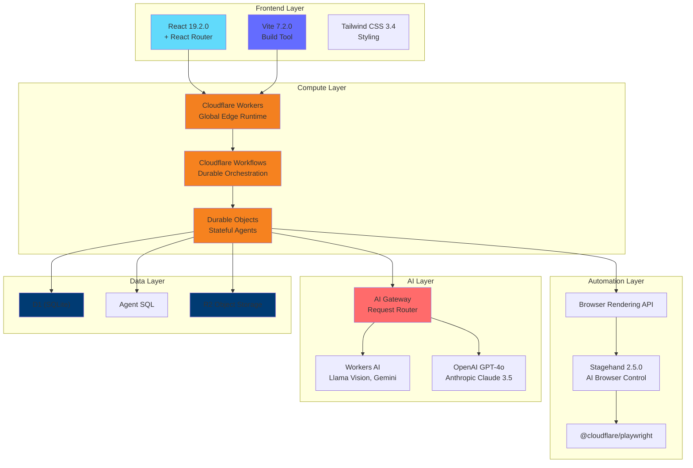
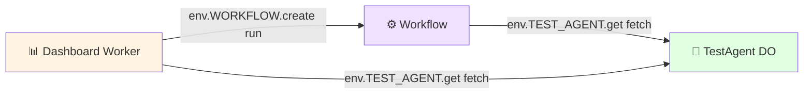
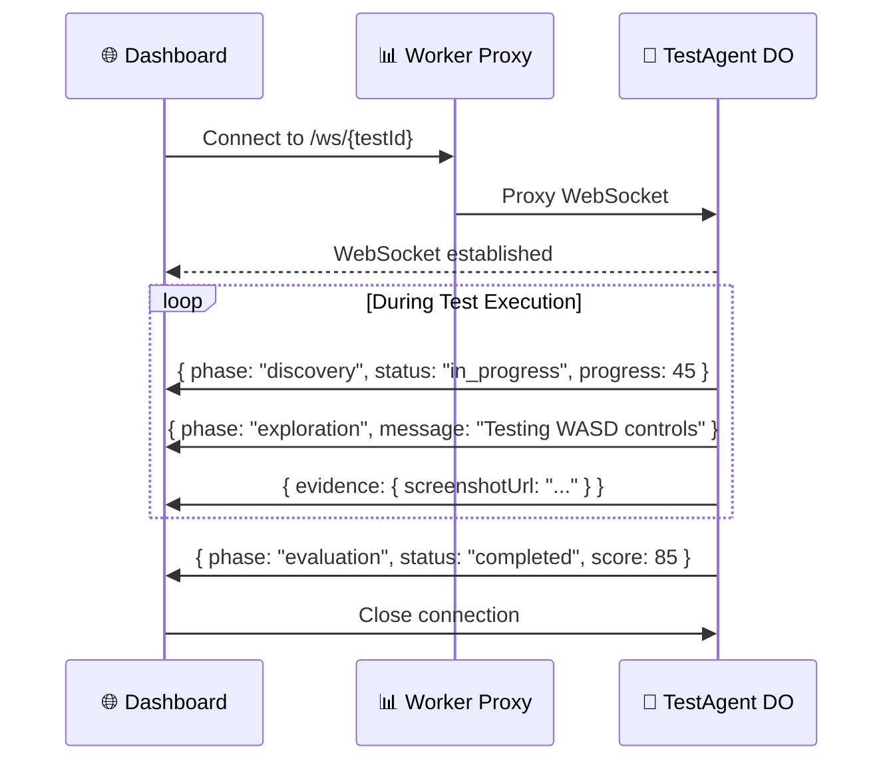
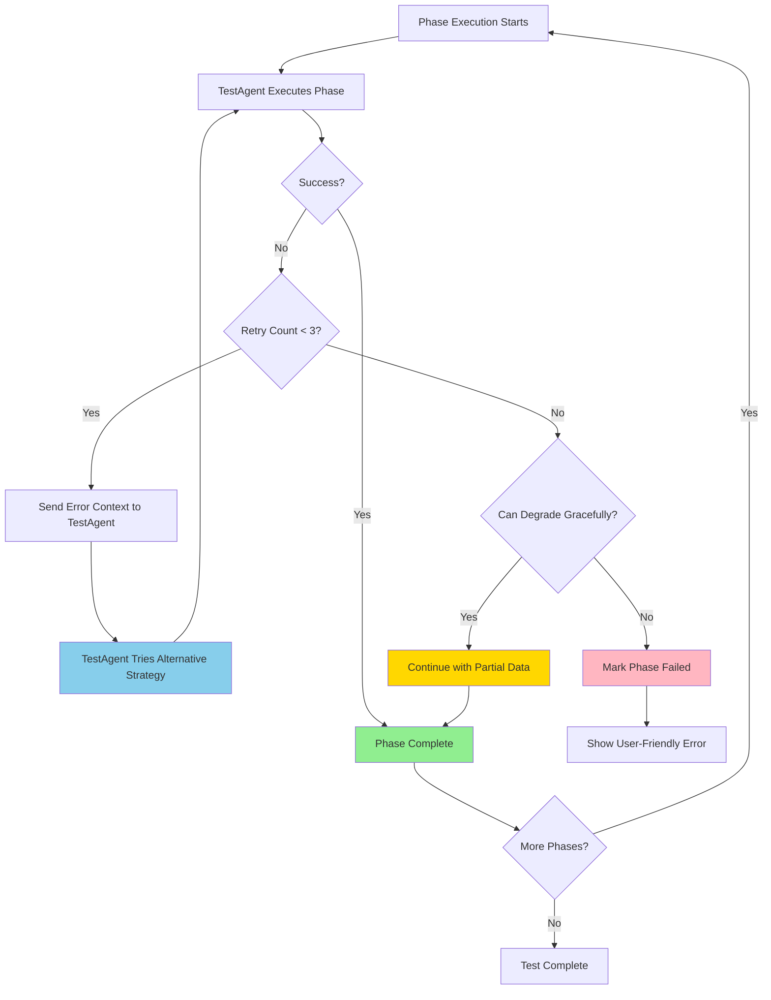
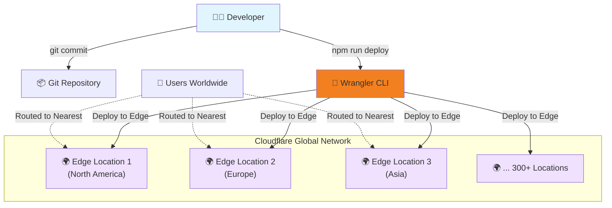
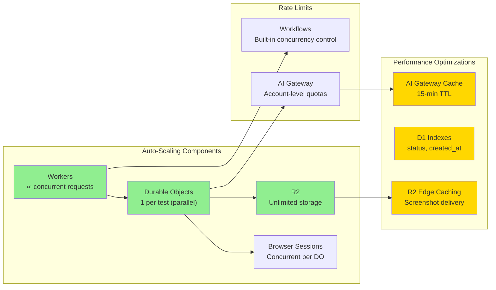

# GameEval Architecture Diagram

**Generated:** 2025-11-06  
**Purpose:** Visual representation of GameEval's component architecture, data flow, and technology stack.

---

## System Architecture Overview



---

## 4-Phase Test Execution Flow



---

## Novel Pattern: TestAgent as Durable Object



**Key Benefits:**
- ✅ **Single Source of Truth:** All test state in one DO instance
- ✅ **Browser Persistence:** Session survives across phases (faster, maintains game state)
- ✅ **Built-in WebSocket:** Real-time updates without polling
- ✅ **Stateful Retry:** Workflow retries preserve TestAgent context

---

## Data Architecture



**Storage Strategy:**
- **D1 (SQLite):** Cross-test metadata, queryable reports
- **Agent SQL (Per-DO):** Ephemeral per-test decisions, not shared
- **R2 (Objects):** Binary artifacts (screenshots, logs)

---

## Technology Stack Layers



---

## Communication Patterns

### 1. RPC Service Bindings (Internal Only)



**No HTTP APIs Exposed** - All communication via Cloudflare service bindings

---

### 2. WebSocket Real-Time Updates



**Benefits:** No polling, instant updates, browser maintains connection

---

## Error Handling & Retry Strategy



**Multi-Level Resilience:**
1. **Workflow Level:** Automatic exponential backoff retry (2 retries per phase)
2. **TestAgent Level:** Receives error context, adapts strategy
3. **User Level:** All errors translated to actionable messages

---

## Deployment Architecture



**Deployment Commands:**
```bash
# Deploy to production
npm run deploy  # Builds frontend + deploys Worker

# Rollback if needed
npx wrangler rollback
```

**Zero Infrastructure:**
- ✅ No CI/CD pipeline
- ✅ No container orchestration
- ✅ No load balancers
- ✅ Automatic global distribution

---

## File Organization

```
gameeval-qa-pipeline/
├── src/
│   ├── index.ts                    # 📊 Dashboard Worker entry point
│   ├── workers/
│   │   └── dashboard.ts            # Frontend serving + RPC handler
│   ├── workflows/
│   │   └── gameTestPipeline.ts     # ⚙️ 4-phase orchestration
│   ├── agents/
│   │   └── TestAgent.ts            # 🤖 TestAgent Durable Object
│   ├── shared/
│   │   ├── types.ts                # TypeScript interfaces
│   │   ├── constants.ts            # Config, timeouts, error messages
│   │   └── helpers/
│   │       ├── r2.ts               # R2 upload/retrieval
│   │       ├── d1.ts               # D1 query helpers
│   │       └── ai-gateway.ts       # AI request wrapper
│   └── frontend/
│       ├── main.tsx                # React entry point
│       ├── App.tsx                 # Dashboard UI
│       └── components/             # React components
├── migrations/
│   ├── 0001_create_test_runs.sql
│   ├── 0002_create_evaluation_scores.sql
│   └── 0003_create_test_events.sql
├── wrangler.toml                   # Cloudflare configuration
├── package.json
└── tsconfig.json
```

---

## Key Architectural Decisions (ADRs)

| ADR | Decision | Rationale |
|-----|----------|-----------|
| **ADR-001** | Monorepo with RPC-Only | Simplifies deployment, no exposed APIs |
| **ADR-002** | Single TestAgent DO Per Test | Stateful execution, persistent browser session |
| **ADR-003** | Workflow Auto-Retry with Error Awareness | Resilient testing, adaptive strategies |
| **ADR-004** | AI Gateway as Primary Entry Point | Cost optimization, automatic failover |
| **ADR-005** | Direct Wrangler Deploy (No CI/CD) | Reduces complexity, instant deployments |
| **ADR-006** | WebSocket for Real-Time Updates | Better UX than polling, instant feedback |
| **ADR-007** | Agent SQL for Ephemeral Data, D1 for Metadata | Optimized storage per use case |

---

## Scalability & Performance



**Expected Performance:**
- **Test Duration:** 6-8 minutes per game (4 phases)
- **Concurrent Tests:** 100+ simultaneous (limited by AI quotas)
- **Dashboard Load Time:** < 2s (edge-cached)
- **WebSocket Latency:** < 100ms (edge proximity)

---

## Summary

**Architecture Style:** Serverless Edge Computing  
**Deployment Model:** Global Edge Network  
**Communication:** RPC + WebSocket (no REST APIs)  
**State Management:** Durable Objects (strong consistency per test)  
**Data Strategy:** Tiered (D1 metadata, Agent SQL decisions, R2 artifacts)  
**Resilience:** Multi-level retry + graceful degradation  
**Monitoring:** Built-in Cloudflare Observability

**Core Strengths:**
1. ✅ **Zero Infrastructure:** No servers, VMs, or containers
2. ✅ **Auto-Scaling:** Handles 1 or 1000 tests without config changes
3. ✅ **Stateful Agents:** Browser sessions persist across phases
4. ✅ **Real-Time UX:** WebSocket updates, no polling lag
5. ✅ **Cost-Optimized:** Workers AI primary, zero egress fees

**Novel Innovations:**
1. 🎯 TestAgent as Durable Object pattern
2. 🎯 Event-driven progress streaming via built-in WebSocket
3. 🎯 Workflow-orchestrated multi-phase testing with error recovery

---

_This diagram was generated by Winston (Architect Agent) based on the validated GameEval architecture._

